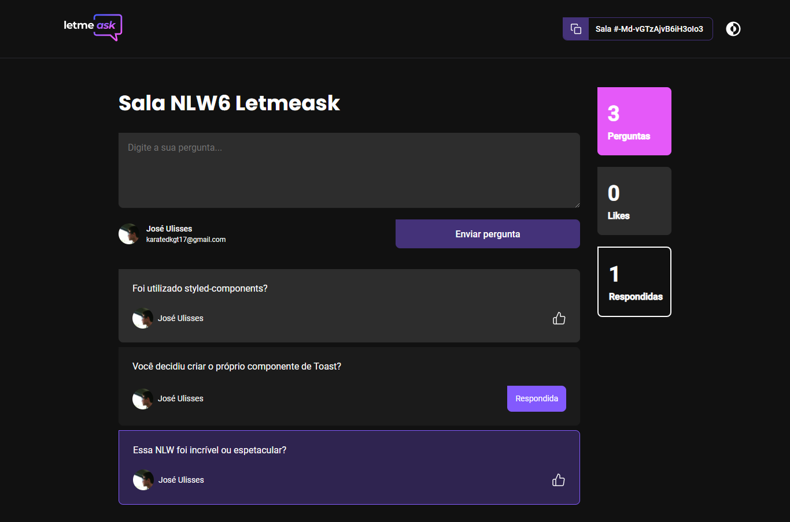

<h1 align="center">Letmeask 💬</h1>



<p align="center">
  Crie salas de Q&amp;A ao-vivo. Tire as suas dúvidas da sua audiência em tempo-real
</p>

## :purple_circle: Tecnologias usadas

- [ReactJS](https://reactjs.org/) + [Typescript](https://www.typescriptlang.org/)
- [Styled-components](https://styled-components.com/)
- [Styled-react-modal](https://github.com/AlexanderRichey/styled-react-modal#readme)
- [Firebase](https://firebase.google.com/)
- [react-router-dom](https://reactrouter.com/web/guides/quick-start)

## :purple_square: Recursos adicionados ao projeto

- Thema escuro
- Página não encontrada/Not Found
- Rota para exibir todas as salas
- Contagem do total de perguntas, likes e perguntas respondidas
- Redirecionamento direto para a rota *admin* após criar a sala
- Criar um component **Toast** do zero para usar em diversos momentos
- Exibir uma sala fechada, mas sem permitir criação de perguntas

## :bangbang: Pré-requisitos

- Node.js
- Yarn, NPM ou outro gerenciador de pacotes javascript

## :heavy_check_mark: Como utilizar

Clone o repositório

```bash
git clone https://github.com/jos3s/nlw06-letmeask.git

-- ou com github cli--

gh repo clone jos3s/nlw06-letmeask
```

Entre na pasta

```bash
cd nlw06-letmeask
```

Instale as dependências

```bash
yarn install 

-- ou --

npm install
```

Preencha um arquivo *.env* com as variaveis do *.env.example*.

E inicie a aplicação

```bash
yarn start 

-- ou --

npm start
```

---  

<p align="center">
  Desenvolvido  por <a href="https://github.com/jos3s">José Ulisses </a>
</p>
